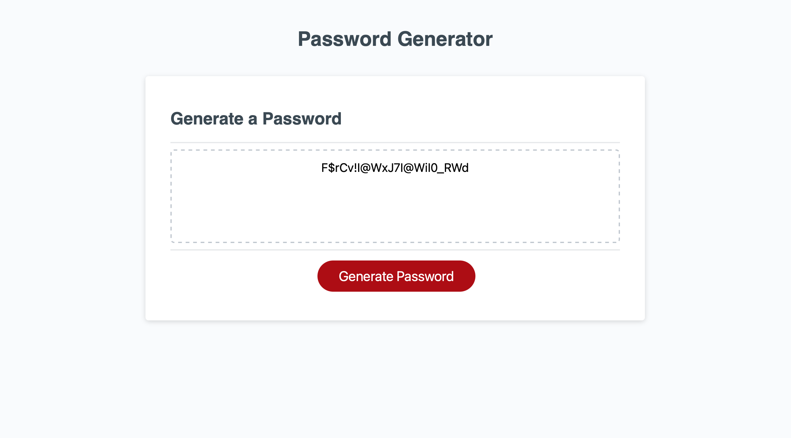

# secure-password-generator

View this page at https://amberzimmerman.github.io/secure-password-generator/

Built with vanilla javascript, this pages functionality will help the user to generate their own secure password using specific criteria. The user can select the length of the password plus a combination of uppercase letters, lowercase letters, numbers and special characters. The password will be most secure if all the above are selected. The generated password will then display on the screen.

A screenshot of the end result of a generated password is below.

